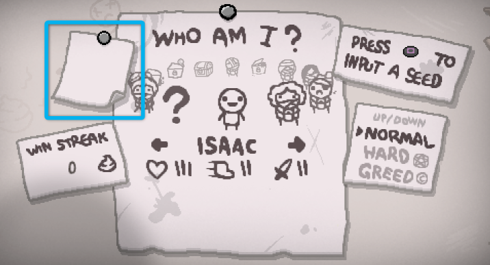
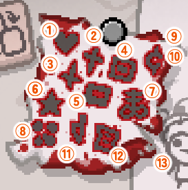

+++
title="クリアマークについて"
template="tipspage.html"

[extra]
contributor="Isaac JP"
+++

キャラクターセレクト画面に討伐したボスに応じたマークが記載されます。

  

- マークは難易度で色が変わり、HARDでマークは赤色になります。
- HARDでクリアすることでNORMALのマークはスキップすることが可能です。
	+ NORMALクリア
	+ GREED ModeとGREEDIR Modeは実績が別となるため、両方をクリアする必要があります。

**クリアマークの見方と各ルートへの到達方法**

  

- **① Mom's Heart (It Lives)**
	- チャプター4-2「Mom's Heart(It Lives)」の討伐マークです。  
Mom's Heartを計11回討伐後、チャプター4のボスとして出現するIt' Livesを討伐することで チャプター5に続く天国ルート・地獄ルートの分岐が発生します。  
※チャプター3-2「Mom」を倒したときに現れる [The Polaroid](/wiki/The_Polaroid "The Polaroid")を取得すると天国ルート、 [The Negative](/wiki/The_Negative "The Negative")を取得すると地獄ルートのチャプター6が出現し、④・⑤のマークを埋めることができます。
- **② Isaac**
	+ ②チャプター5（天国ルート）「Isaac」の討伐マークです。  
「The Polaroid」を取得していると、チャプター6に進むことが可能になり、④を埋めることができます。  
※「The Negative」を持っていてもチャプター6に進むことはできません。
- **③ Satan**
	+ ③チャプター5（地獄ルート）「Satan」の討伐マークです。  
「The Negative」を取得していると、チャプター6に進むことが可能になり、⑤を埋めることができます。  
※「The Polaroid」を持っていてもチャプター6に進むことはできません。
- **④ ??? (BlueBaby)**
	+ ④チャプター6（天国ルート）「???」の討伐マークです。
- **⑤ The Lamb**
	+ ⑤チャプター6（地獄ルート）「The Lamb」の討伐マークです。
- **⑥ ボスラッシュ**
	+ ⑥ボスラッシュクリアのマークです。  
出現条件はチャプター3-2「Mom」を20分以内に倒すことです。（壁際に穴が開き入り口が出現します。）
- **⑦ Mega Satan**
	+ ⑦チャプター6の裏ボス「Mega Satan」討伐マークです。  
これは天国ルート、地獄ルートどちらでも構いません。しかし、入場するのに特別なアイテムが必要となります。  
正攻法は [Key Piece 1](/wiki/Key_Piece_1 "Key Piece_1")・ [Key Piece 2](/wiki/Key_Piece_2 "Key Piece 2")を揃えることです。  
上記はそれぞれ、天使部屋に出現する天使像を爆破することで出現する、「Uriel」・「Gabriel」を倒すことで手に入れることができます。  
Key Peace1/2を入手して完成するKeyを持ってチャプター6の初期Roomに行くと上方向にMega Satan Roomのドアが出現します。  
※チャプター6には絶対行かないといけないので、「The Polaroid」を取って地獄ルートに行ったりしないように！（その逆も然り）
- **⑧ Hush**
	+ ⑧チャプター4-2の裏ボス「Hush」の討伐マークです。  
チャプター出現条件は、チャプター4-2「It Lives」を30分以内に倒すことです。（壁際に入り口が出現します。）
- **⑨ Ultra Greed**
	+ ⑨Greedモードのボス「Ultra Greed」の討伐マークです。
- **⑩ Ultra Greedier**
	+ ⑩Greedierモードのボス「Ultra Greedier」の討伐マークです。Greedモードのハード版に当たります。
- **⑪ Mother**
	+ ⑪チャプター4-2の裏の裏ボス「Mother」の討伐マークです。  
詳細は→[リペンタンスDLC追加ボス：Mohter](/Tips/boss_mother/ "リペンタンス追加ボス：Mother")
- **⑫ The Beast**
	+ ⑫エンドゲームチャプター「The Beast」の討伐マークです。  
詳細は→[リペンタンスDLC追加ボス：Beast](/Tips/boss_beast/ "リペンタンス追加ボス：Beast")
- **⑬ Delirium**
	+ ⑬エンドゲームチャプター「Delirium」の討伐マークです。チャプター出現条件は以下の通りとなります。  
出現時は次フロア移動の穴の他に専用のワームホールが出現します。
		+ 「It Lives」を討伐後、10%の確率で出現
		+ 「Isaac」、「Satan」を討伐後15%の確率で出現
		+ 「???」、「The Lamb」を討伐後20%の確率で出現
		+ 「Mega Satan」を討伐後50%の確率で出現
		+ 「Hush」を討伐後100%の確率で出現
	+ ※ノーマルをクリアするとマークの紙がボロボロ、ハードをクリアすると紙が血染めになります。