+++
title="シークレットルームについて"
template="tipspage.html"

[extra]
contributor="Owatax_"
+++

#### シークレットルーム・基本編

～シークレットルームが配置される大まかなルールについて～

**一**、3つ以上部屋が隣接していること  
-  (レアケースだが、部屋同士が離れている、かなり直線状なマップの場合、2部屋、1部屋のみ隣接してるところに配置される)

**二**、隣接している部屋間は通行が可能であること
- 下の画像のように、3つの部屋に隣接していても、シークレットルームの出入り口になる箇所が塞がれている場合は配置されない。出入り口になる箇所にトゲ等がある場合も同様。  
 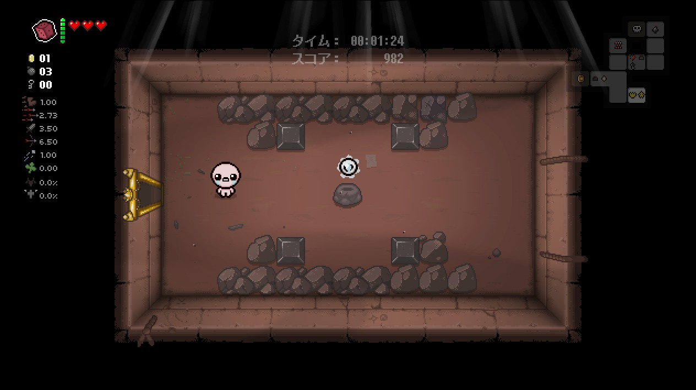 

**三**、ボスルームには隣接しない
- ボスルーム・スーパーシークレットルームを除く、あらゆるタイプの部屋の隣に配置される。

**四**、狭いタイプの部屋からは、狭くなっている側に隠し部屋は配置されない。
- 下の画像の場合、この部屋の上下には隠し部屋は配置されない。しかし、ルールに則っている場合、行き止まりの先に配置されることもある。  
 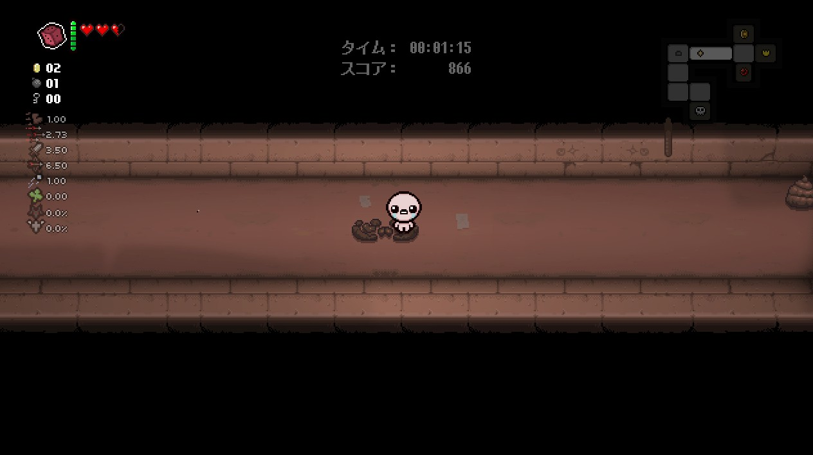 

これらの条件を満たしている場合、シークレットルームが配置されている場所にボムを設置することでシークレットルームに入ることができる。  
 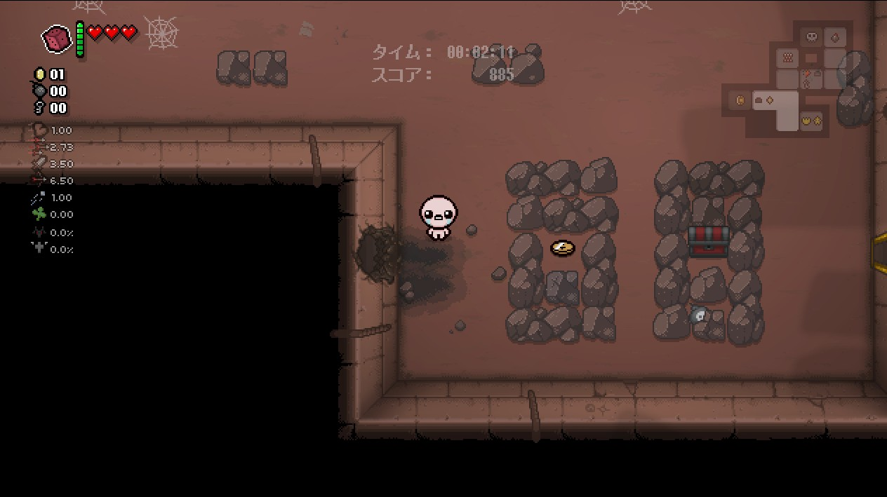   
 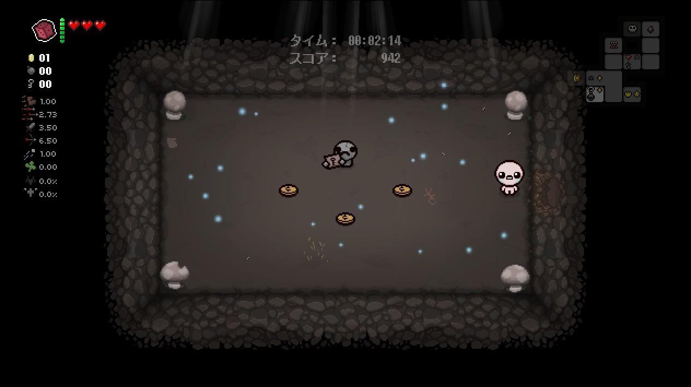 

#### シークレットルーム・実践編 1

まず、シークレットルームが配置される候補を絞ること。  
(慣れないうちは、ボス部屋以外のマップを踏破してから考えよう！)

- **一、3つ以上部屋が隣接していること**
- **三、ボスルームには隣接しない**

の規則に従うと、左の画像から、右の画像まで候補が絞れる。

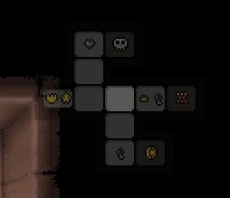  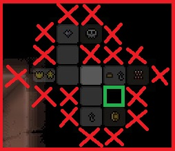

今回は素直に配置される候補の箇所が一つに絞れているので、
緑枠に隣接している部屋の側面にボムを設置することで隠し部屋を発見できる。

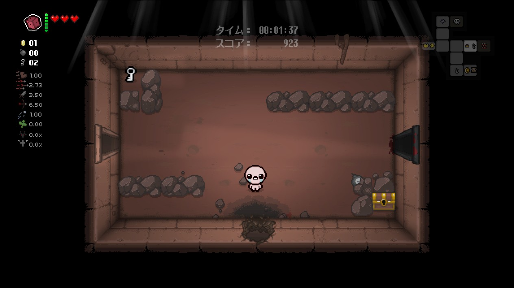

#### シークレットルーム・実践編 2

シークレットルーム・基本には、2部屋に隣接しているパターンはレアケースと紹介したが、マップの構成によっては、3つ以上隣接していても、

- 二、隣接している部屋間は通行が可能であること
- 四、狭いタイプの部屋からは、狭くなっている側に隠し部屋は配置されない。

のルールで候補から外れてしまうこともあるため、実は、**2つ以上部屋が隣接していること**を基準に候補を絞った方が早く発見できることもあります。

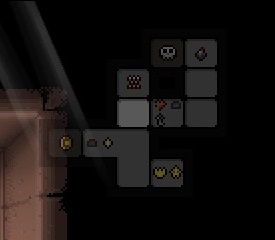 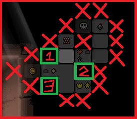

今回は3つの候補に絞ることができました。
- 一、3つ以上部屋が隣接していること

に従う場合は、候補2が該当しそうですが、候補2の上に位置する部屋はオブジェクトで塞がっているため、

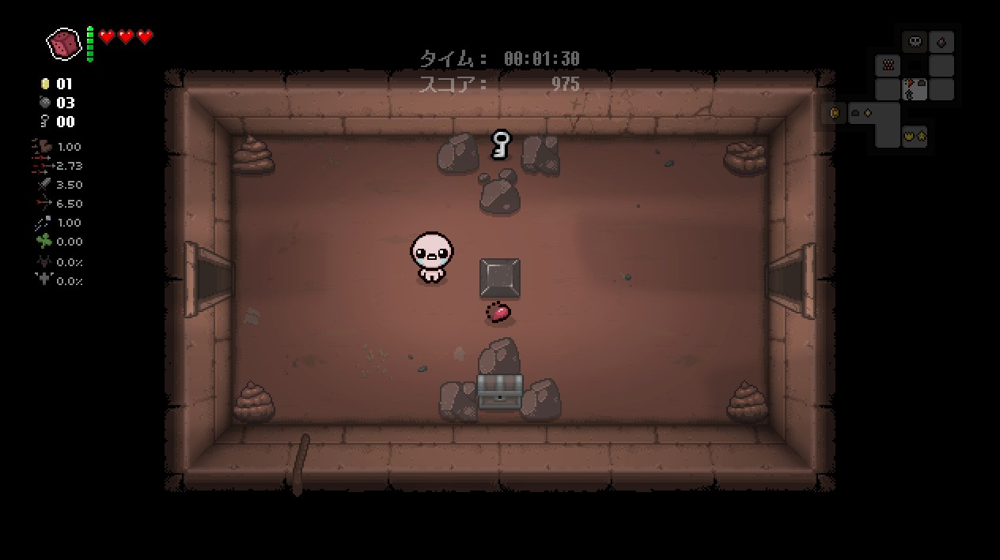

- 二、隣接している部屋間は通行が可能であること

に基づき、候補2はシークレットルームの対象外になります。
1と3に隣接する部屋は、道を塞ぐオブジェクトもなく、どちらもシークレットルームの候補です。

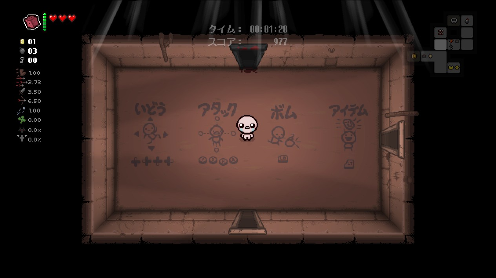 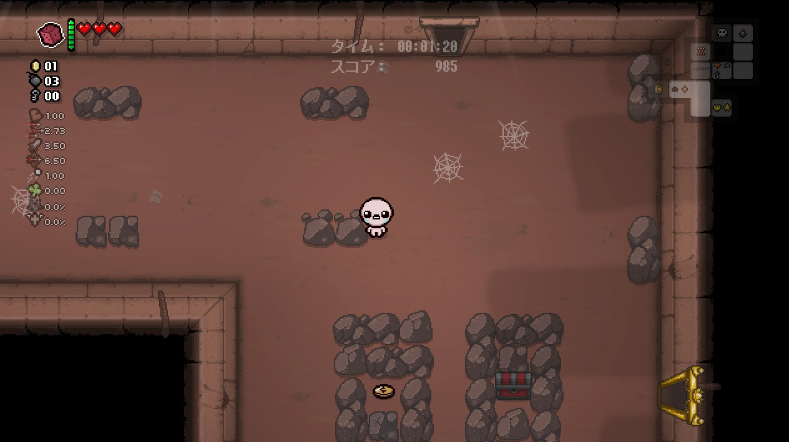

この場合、どちらかがシークレットルームの候補になります。
所持しているボムが少ないときに外してしまった場合損するため、無理に探さない方が良いこともあります。
(今回のケースは、3番がシークレットルームでした。)

