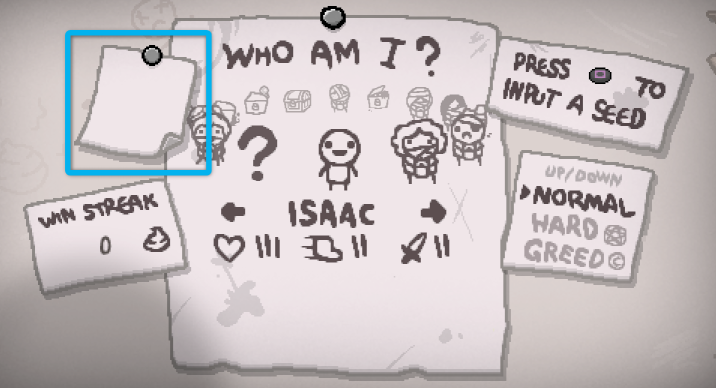
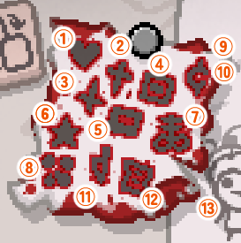

+++
title="クリアマークについて"
template="page.html"

[extra]
contributor="Isaac JP"
+++

キャラクターセレクト画面左上の紙には討伐したボスと難易度に応じたマークが記載されます。

  

- マークの色は難易度で変わり、HARDでマークは赤色になります。
- HARDでクリアすることでNORMALのマークはスキップすることが可能です。
- GREED ModeとGREEDIR Modeは実績が別となるため、両方をクリアする必要があります。

#### クリアマークの見方と各ルートへの到達方法

  

1. **Mom's Heart (It Lives)**
	+ チャプター4-2「Mom's Heart (It Lives)」の討伐マークです。  
	+ 「Mom's Heart」を計11回討伐後、チャプター4のボスとして「It Lives」が出現します。「It Lives」を討伐することでそれぞれ異なるチャプター5（天国ルート・地獄ルート）に続くトラップドアが生成されます。チャプター3-2で「Mom」を倒したときに現れる [The Polaroid](/wiki/The_Polaroid "The Polaroid")を取得して天国ルートに行く、もしくは [The Negative](/wiki/The_Negative "The Negative")を取得して地獄ルートに行くと更にチャプター6に進むことができます。
2. **Isaac**
	+ チャプター5（天国ルート）「Isaac」の討伐マークです。  
	+ チャプター3で [The Polaroid](/wiki/The_Polaroid "The Polaroid")を取得してチャプター4で天国ルートを選択した場合、チャプター6（天国ルート）に進むことが可能になり、④を埋めることができます。  
3. **Satan**
	+ チャプター5（地獄ルート）「Satan」の討伐マークです。  
	+ チャプター3で [The Negative](/wiki/The_Negative "The Negative")を取得してチャプター5で地獄ルートを選択した場合、チャプター6（地獄ルート）に進むことが可能になり、⑤を埋めることができます。  
4. **??? (BlueBaby)**
	+ チャプター6（天国ルート）「???」の討伐マークです。
5. **The Lamb**
	+ チャプター6（地獄ルート）「The Lamb」の討伐マークです。
6. **ボスラッシュ**
	+ ボスラッシュクリアのマークです。  
	+ 出現条件はチャプター3-2「Mom」を20分以内に倒すことです（ボス部屋の壁に入口が出現します）。
7. **Mega Satan**
	+ チャプター6の裏ボス「Mega Satan」討伐マークです。  
	+ これは天国ルート、地獄ルートどちらでも構いません。しかし、入場するのに特別なファミリアが必要となります。  正攻法は [Key Piece 1](/wiki/Key_Piece_1 "Key Piece_1")・ [Key Piece 2](/wiki/Key_Piece_2 "Key Piece 2")を揃えることです。Key Piece はそれぞれ、天使部屋に出現する天使像を爆破することで出現する「Uriel」・「Gabriel」を倒すことで手に入れることができます。Key Piece 1, 2 を入手して完成するカギのファミリアを持って**チャプター6に行く**[^ch6]とスタート部屋の上方向に Mega Satan Room のドアが出現します。  
8. **Hush**
	+ チャプター4-2の裏ボス「Hush」の討伐マークです。  
	+ チャプター出現条件は、チャプター4-2「It Lives」を30分以内に倒すことです（ボス部屋の壁に入口が出現します）。
9. **Ultra Greed**
   + Greedモードのボス「Ultra Greed」の討伐マークです。
10. **Ultra Greedier**
	+ Greedierモードのボス「Ultra Greedier」の討伐マークです。Greedモードのハード版に当たります。
11. **Mother**
	+ チャプター4-2の裏ボス「Mother」の討伐マークです。  
    + [リペンタンスDLC追加ボス：Mother](/tips/boss_mother/ "リペンタンス追加ボス：Mother")
12. **The Beast**
	+ エンドゲームチャプター「The Beast」の討伐マークです。  
	+ [リペンタンスDLC追加ボス：Beast](/tips/boss_beast/ "リペンタンス追加ボス：Beast")
13. **Delirium**
	+ エンドゲームチャプター「Delirium」の討伐マーク[^deli]です。チャプター出現条件は以下の通りとなります。出現時は次フロア移動の穴の他に専用のワームホールが出現します。
        + 「It Lives」を討伐後、10%の確率で出現
        + 「Isaac」、「Satan」を討伐後15%の確率で出現
        + 「???」、「The Lamb」を討伐後20%の確率で出現
        + 「Mega Satan」を討伐後50%の確率で出現
        + 「Hush」を討伐後100%の確率で出現

[^ch6]: チャプター6に行く必要があるので、** [The Polaroid](/wiki/The_Polaroid "The Polaroid")を取得して地獄ルートに行ったり、 [The Negative](/wiki/The_Negative "The Negative")を取得して天国ルートに行ってはいけません**。

[^deli]: Delirium の討伐マークは他の討伐マークとは異なり、ノーマルをクリアすると紙がボロボロ、ハードをクリアすると紙が血染めになります。