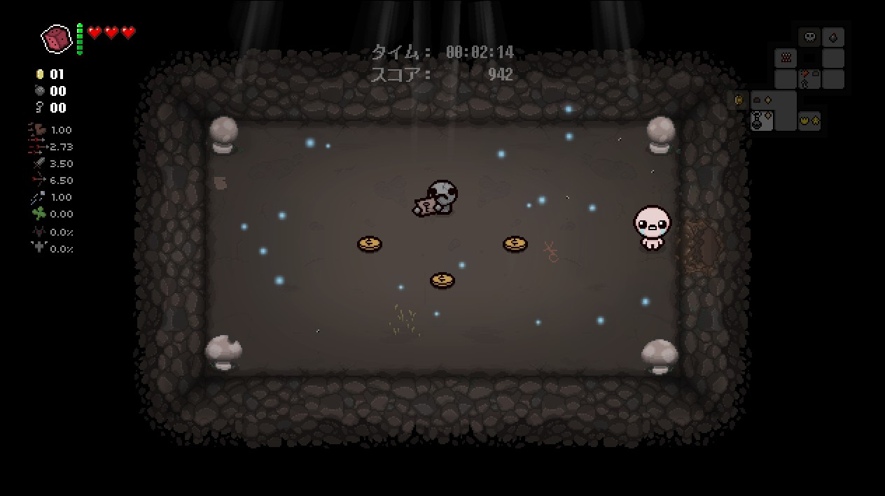
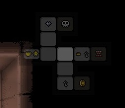
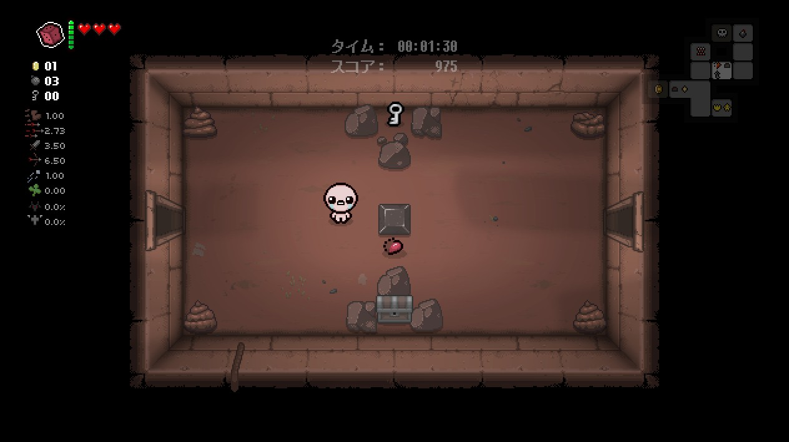
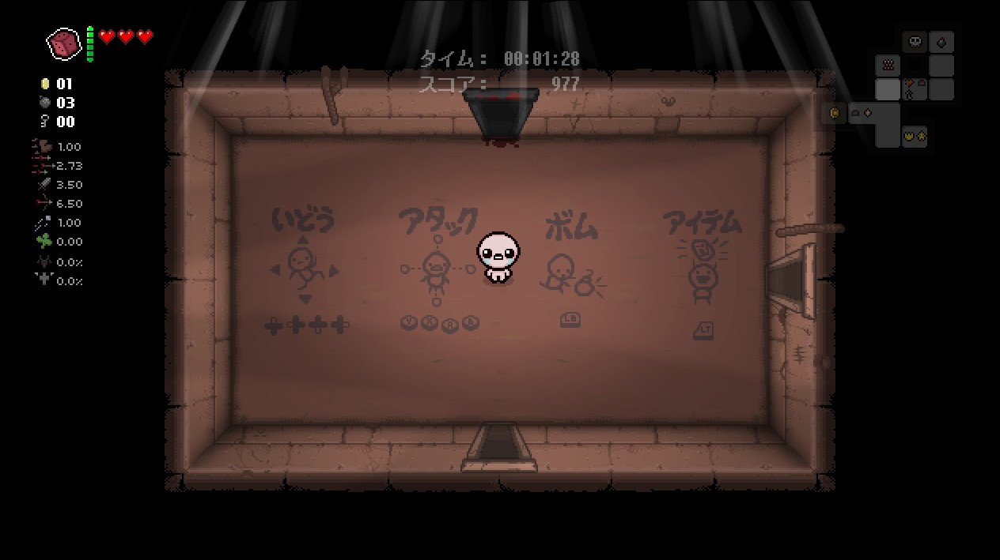
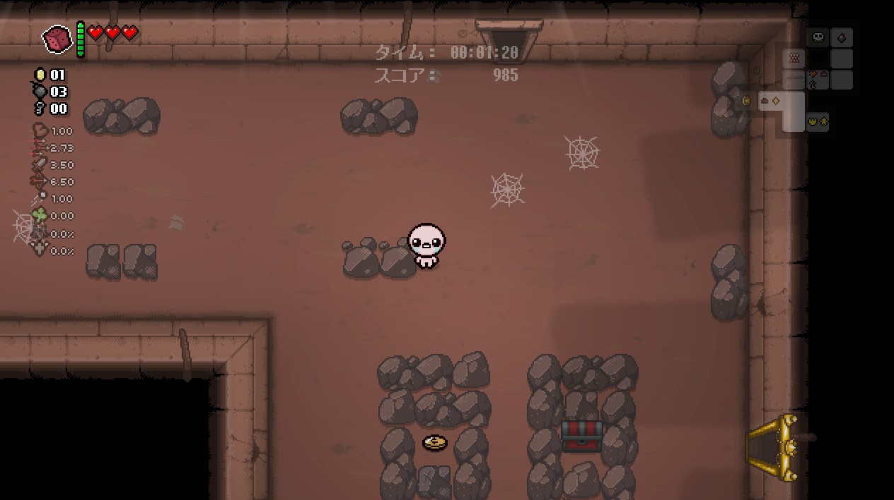

+++
title="シークレットルームについて"
template="page.html"

[extra]
contributor="Owatax_"
+++

#### シークレットルーム・基本編

シークレットルームが配置される大まかなルール。**太字**は必ず適用されるルール。

1. 通常、3つ以上の部屋が隣接している（3つ以上の入口を持つ）[^1]

2. **ボスルーム・スーパーシークレットルームには隣接しない**
3. **シークレットルームは隣接している全ての部屋と通行が可能である**
   - シークレットルームの出入り口になる箇所が障害物（岩・トゲ・穴など）で塞がれている場合、その先には**必ず**配置されない。下の画像の場合、上の空間は3つの部屋と隣接しているものの、岩で塞がれているのでシークレットルームがないと分かる。
  
1. **狭いタイプの部屋からは、狭くなっている側に隠し部屋は配置されない**
   - 下の画像の場合、この部屋の上下の空間には隠し部屋は配置されない。行き止まりの先には配置されることもある。  
  

---

シークレットルームに面した壁の中央を爆破することでシークレットルームに入ることができる。 

    
  

---

#### シークレットルーム・実践編 1

まず、シークレットルームが配置される候補を絞ること。  
(慣れないうちは、ボス部屋以外のマップを踏破してから考えよう！)

- **3つ以上部屋が隣接している**
- **ボスルームには隣接しない**

の規則に従うと、左の画像から、右の画像まで候補が絞れる。

  

今回は配置される候補の箇所が一つ（緑枠）なので、これと隣接している部屋の側面にボムを設置することでシークレットルームに入ることができる。

#### シークレットルーム・実践編 2

2部屋に隣接しているパターンはレアケースと紹介したが、マップの構成によっては、3つ以上隣接していても、

- 隣接している部屋間は通行が可能である
- 狭いタイプの部屋からは、狭くなっている側に隠し部屋は配置されない

のルールで候補から外れてしまうこともあるため、**2つ以上部屋が隣接していること**を基準に候補を絞った方が実用上役立つことがある。下の画像の場合にこの緩和したルールを適用すると、シークレットルームの場所は3つの候補に絞られる。

 

- 3つ以上部屋が隣接していること

のルール従う場合は、候補2のみが残るが、候補2の上に位置する部屋との連絡がオブジェクトで塞がっているため（下図）、

- 隣接している部屋間は通行が可能である

に基づき、候補2はシークレットルームが配置されない。

1と3に隣接する部屋は入口を塞ぐオブジェクトもなく、どちらもシークレットルームの候補になる。

 

所持しているボムが少なく候補が多い場合は無理に探さない選択もある。

（今回は3番がシークレットルームでした。）

[^1]: 隣接する部屋数のルールは絶対ではない。特に部屋同士が離れていたりマップが直線的な場合、隣接する部屋数が2部屋、1部屋の場合もある。