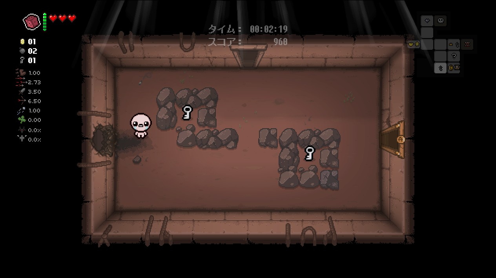
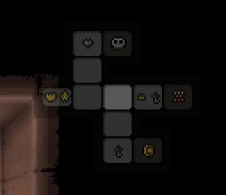
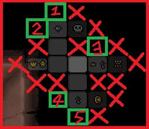
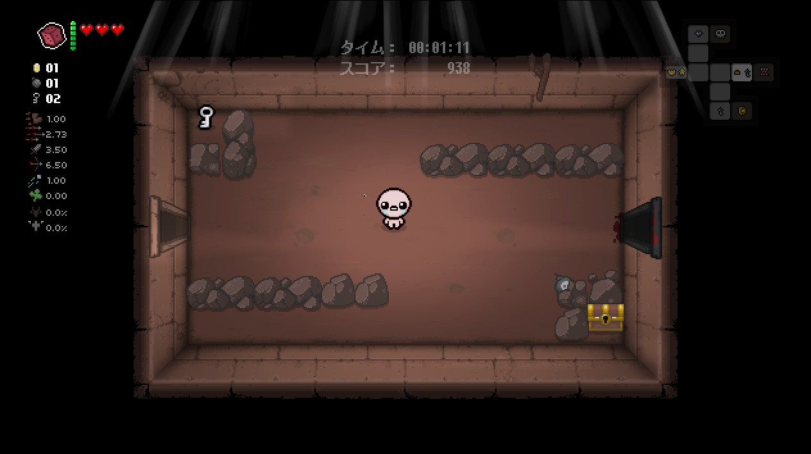

+++
title="スーパーシークレットルームについて"
template="tipspage.html"

[extra]
contributor="Owatax_"
+++

#### スーパーシークレットルーム・基本編

～スーパーシークレットルームが配置される大まかなルール～

**一**、隣接している部屋が1つだけであること

**二**、隣接している部屋間は通行が可能であること
- 左の画像のように出入り口が塞がれている場合はシークレットルーム同様に配置されない。
- ゲーム後半のマップでは、道の先が崖になっていることがある場合もあり、そちらも同様に配置されない。

  

**三**、ボスルームを含む特殊なルームには隣接しない
- シークレットルームと異なり、アイテムルームやショップルームの隣には配置されない。

**四**、各フロアのスタート地点から、ボスルームより近く、ショップルームと同等の距離に配置される
- フロアの生成ルールに基づいての規則になるため、例外もあるが、ボス部屋の近くに生成されることが多い。
- ループが発生しているフロアではこの法則が成り立たないこともある。

  

これらの条件を満たしている場合、シークレットルームが配置されている場所にボムを設置することでシークレットルームに入ることができる。	

#### スーパーシークレットルーム・実践編

スーパーシークレットルームが配置される候補を絞るのはシークレットルームと同じ。

- 一、隣接している部屋が1つだけであること
- 三、ボスルームを含む特殊なルームには隣接しない

実践1と同じマップで候補を絞っても候補が多く、見つけることが難しい。

  

スタート地点(右画像で白く光っている部屋)からボスルームへの距離が3部屋、  
ショップルームへの距離が2部屋になっているため、  

- 四、各フロアのスタート地点から、ボスルームより近く、ショップルームと同等の距離に配置される

に基づくと、候補1と候補2は距離が3部屋、候補3は距離が1部屋になっていることから、  
隠し部屋の候補が候補4か候補5に絞ることができる。

今回は候補4がスーパーシークレットルームになっていました。